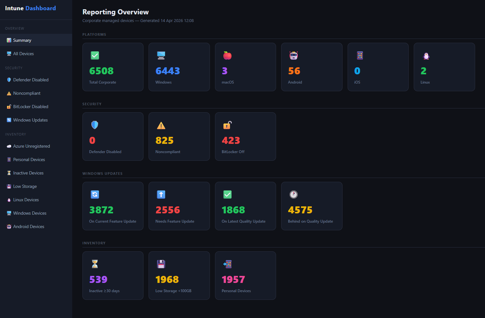
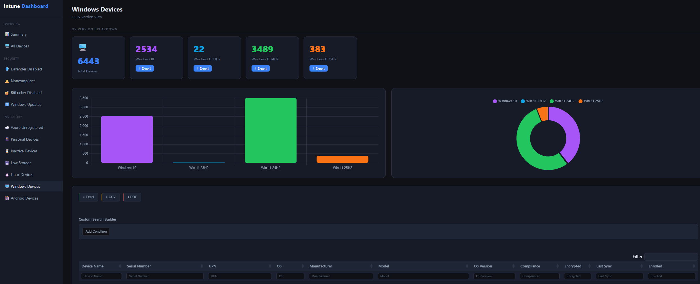
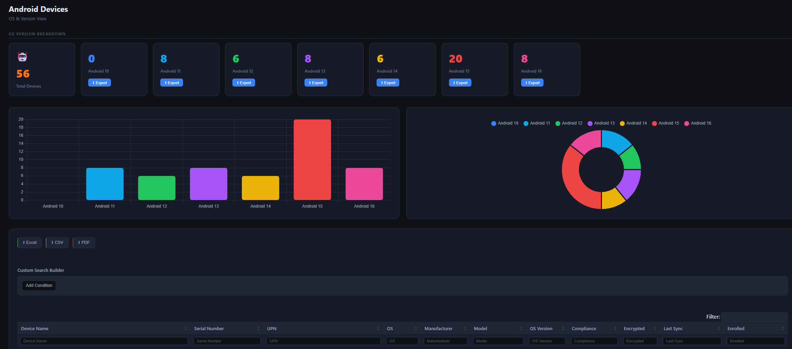
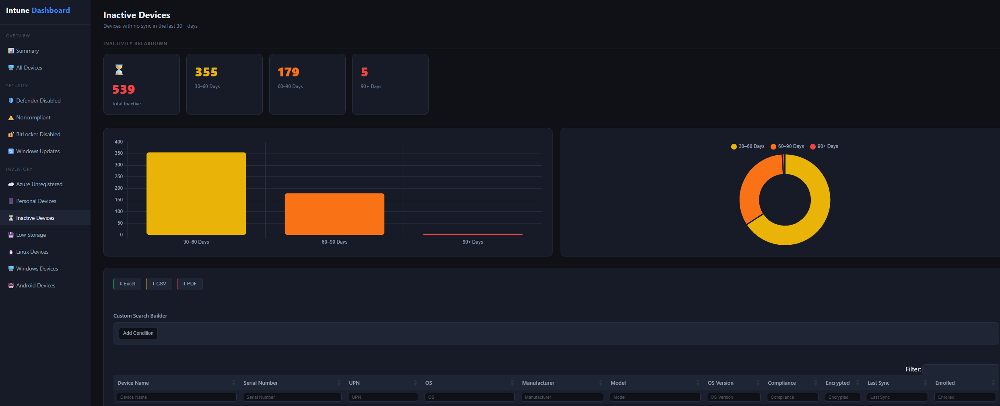

# Intune Dashboard (PowerShell + Microsoft Graph)

A PowerShell dashboard script that pulls Intune managed device data from Microsoft Graph and renders a modern, interactive HTML report.

## What it does

- Retrieves Intune managed devices from Microsoft Graph using paged REST calls.
- Separates corporate devices from personal devices.
- Builds an executive summary view with key counts across Platforms, Security, Windows Updates, and Inventory.
- Provides detailed pages for:
  - **All Devices** — full corporate inventory with platform overview cards
  - **Defender Disabled** — devices with real-time protection off
  - **Noncompliant** — devices not meeting compliance policy
  - **BitLocker Disabled** — unencrypted devices
  - **Windows Update Status** — Feature Update and Quality Update compliance with charts and drill-down tables
  - **Azure Unregistered** — devices not registered in Entra ID
  - **Personal Devices** — devices owned by users
  - **Inactive Devices** — 30+ days since last sync, with inactivity period charts (30–60, 60–90, 90+ days)
  - **Low Storage** — devices with less than 100 GB free
  - **Linux Devices** — with distro breakdown (Ubuntu, Debian, Fedora, RHEL, Other)
  - **Windows Devices** — with OS version breakdown (Windows 10, 11 23H2/24H2/25H2) and charts
  - **Android Devices** — with OS version breakdown (Android 10–16) and charts
- Adds table tools for:
  - Global search
  - Per-column search inputs
  - SearchBuilder advanced filtering
  - Export to Excel, CSV, and PDF
- Per-version CSV export buttons for Windows, Android, and Linux version groups.
- All charts built with Chart.js (bar + doughnut).

## Screenshots









## Requirements

- PowerShell 7.0 or later
- Microsoft Graph PowerShell authentication available (`Connect-MgGraph`)
- Internet access to CDN resources used by DataTables, Chart.js, and extensions

## Permissions

At minimum, use this Microsoft Graph scope:

- `DeviceManagementManagedDevices.Read.All`

## Quick start

1. Open PowerShell 7.
2. Authenticate to Graph:

   ```powershell
   Connect-MgGraph -Scopes "DeviceManagementManagedDevices.Read.All"
   ```

3. Run the script:

   ```powershell
   .\Intune-Dashboard.ps1
   ```

4. The report is written to:

   ```
   C:\temp\Intune-Dashboard.html
   ```

5. The script opens the HTML report automatically.

## Data behavior notes

- Corporate-focused reporting is built from devices where `managedDeviceOwnerType` is `company`.
- Personal Devices view is built from devices where `managedDeviceOwnerType` is `personal`.
- Linux device detection uses pattern matching (linux/ubuntu/debian/fedora/rhel) against the OS name field.
- Windows version classification uses `osVersion` build number prefixes (e.g. `10.0.26100` = Windows 11 24H2).
- Inactive device buckets are calculated relative to the script run time using `lastSyncDateTime`.
- Feature Update compliance treats Windows 11 24H2 and 25H2 as current; Windows 10 and 11 23H2 as outdated.
- Quality Update compliance identifies the latest build per OS version and flags devices not on it.

## Performance notes

- Uses Graph paging with `$top=999` and `@odata.nextLink` until all pages are retrieved.
- Uses parallel processing (`ForEach-Object -Parallel`) for Defender status classification.
- Table rendering is lazy-loaded per page (DataTables initialises only when a page is first opened).
- Charts initialise only once per page visit using a guard flag.

## Changelog

- 3.3 (14-04-2026): 
  - Added Windows Update Status page (Feature Update and Quality Update compliance with charts and exportable tables).
  - Added OS version breakdown charts for Linux Devices (Ubuntu, Debian, Fedora, RHEL, Other). Added inactivity period breakdown charts on the Inactive Devices page (30–60, 60–90, 90+ days). 
  - Added Platform Overview cards to the All Devices page. Moved Windows Updates under the Security nav section. Added Windows Update cards to the Overview dashboard.

- 3.2 (14-04-2026): Added OS version breakdown cards and charts for Windows Devices (Windows 10, 11 23H2, 24H2, 25H2) and Android Devices (Android 10–16), with per-version CSV export.

- 3.1 (13-04-2026): Added JSON export option, improved export button visibility, fixed Linux count visibility in overview cards, added Windows and Android overview counts, and added per-column search inputs with DataTables updates.

- 3.0 (13-04-2026): Complete rewrite with modern dashboard UI, performance improvements, expanded device insights, interactive filtering/export, and updated Graph usage.

- 2.4 (13-04-2026): Added Unicode emoji icons, included macOS count, added Serial Number in all tables, reverted Defender logic, suppressed Graph welcome output, and added All Devices section.

## Troubleshooting

### 401 Unauthorized / token expired

Re-authenticate and run again:

```powershell
Connect-MgGraph -Scopes "DeviceManagementManagedDevices.Read.All"
```

### Command not found for Connect-MgGraph

Install and import the Microsoft Graph module, then authenticate:

```powershell
Install-Module Microsoft.Graph -Scope CurrentUser
Import-Module Microsoft.Graph
Connect-MgGraph -Scopes "DeviceManagementManagedDevices.Read.All"
```

### Dashboard opens but tables look unstyled or features are missing

Check network access to these CDN domains:

- `cdn.datatables.net`
- `code.jquery.com`
- `cdnjs.cloudflare.com`
- `cdn.jsdelivr.net` (Chart.js)

## Folder contents

- `Intune-Dashboard.ps1` — Current dashboard script
- `Archive/` — Previous script versions
